# Geschäftsjahre

Die Seite **Geschäftsjahre** befindet sich im Bereich **Kasse** der linken Navigation. Hier werden alle Geschäftsjahre verwaltet – neue angelegt, laufende abgeschlossen und abgeschlossene eingesehen.

---

## Übersicht

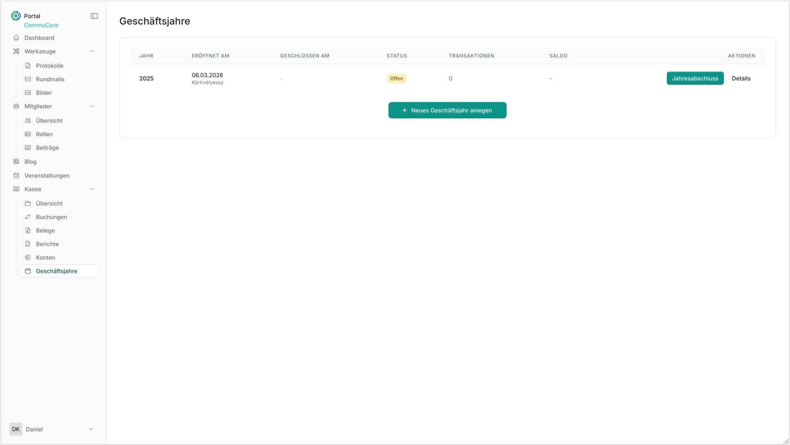

Die Übersichtstabelle zeigt alle vorhandenen Geschäftsjahre mit folgenden Spalten:

| Spalte | Beschreibung |
|---|---|
| **Jahr** | Das Kalenderjahr des Geschäftsjahres |
| **Eröffnet am** | Datum und Benutzer der Eröffnung |
| **Geschlossen am** | Datum und Benutzer des Abschlusses (leer = noch offen) |
| **Status** | `Offen` (gelb) oder `Abgeschlossen` (grün) |
| **Transaktionen** | Anzahl der dem Geschäftsjahr zugeordneten Transaktionen |
| **Saldo** | Gesamtsaldo des Geschäftsjahres |
| **Aktionen** | Schaltflächen für Jahresabschluss und Details |

---

## Neues Geschäftsjahr anlegen

### Schritt 1 – Zur Seite navigieren und Schaltfläche klicken

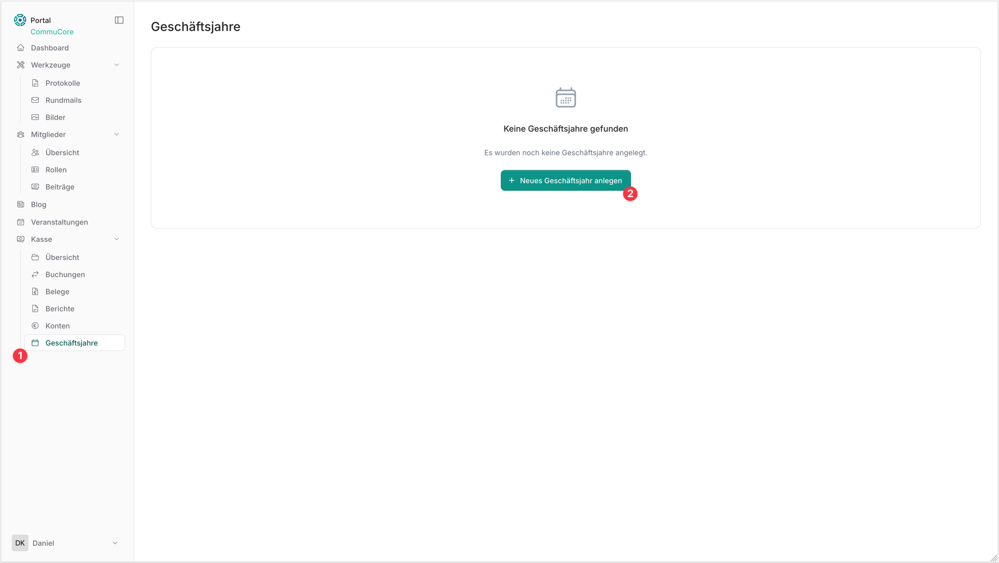

Navigiere über die linke Seitenleiste zu **Kasse → Geschäftsjahre** (**①**). Klicke anschließend auf **+ Neues Geschäftsjahr anlegen** (**②**).

---

### Schritt 2 – Daten eingeben

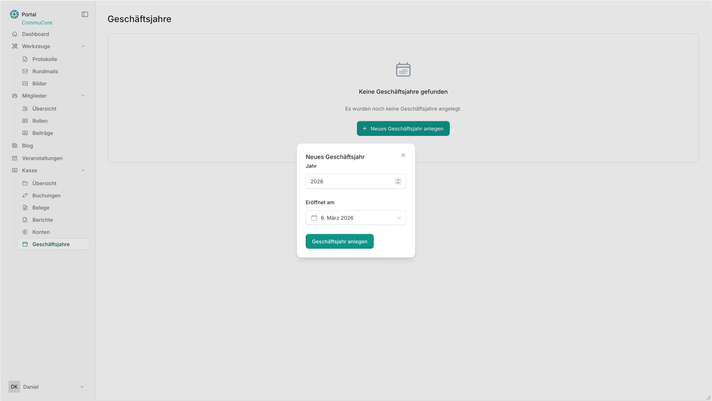

Es öffnet sich ein Dialog mit zwei Feldern:

- **Jahr** – Das Kalenderjahr des neuen Geschäftsjahres (Standardwert: aktuelles Jahr)
- **Eröffnet am** – Das Eröffnungsdatum (Standardwert: heutiges Datum)

Klicke auf **Geschäftsjahr anlegen**, um das Jahr zu erstellen.

> **Hinweis:** Stimmt das eingetragene Eröffnungsdatum nicht mit dem eingetragenen Jahr überein (z. B. Eröffnungsdatum im Jahr 2026 bei Geschäftsjahr 2025), erscheint ein Warnhinweis.

---

### Warnhinweis bei abweichendem Eröffnungsdatum

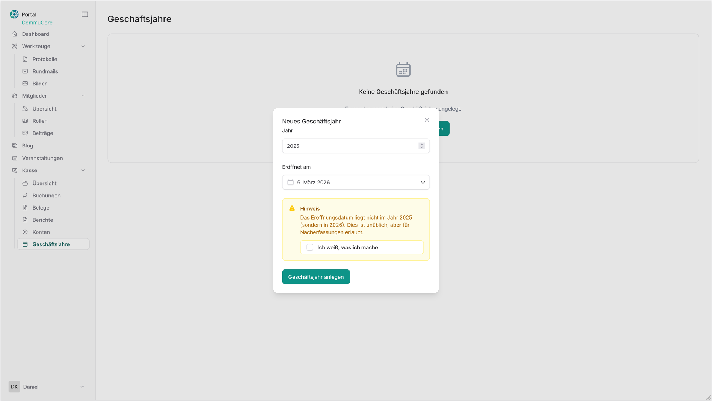

Liegt das Eröffnungsdatum außerhalb des gewählten Jahres, zeigt das System folgende Meldung:

> *„Das Eröffnungsdatum liegt nicht im Jahr 2025 (sondern in 2026). Dies ist unüblich, aber für Nacherfassungen erlaubt."*

Aktiviere die Checkbox **„Ich weiß, was ich mache"**, um die Warnung zu bestätigen und mit dem Anlegen fortzufahren.

---

## Jahresabschluss durchführen

### Schritt 1 – Jahresabschluss starten

Klicke in der Zeile des gewünschten Geschäftsjahres auf die Schaltfläche **Jahresabschluss** (**①**).

---

### Schritt 2 – Transaktionsauswahl: Übersicht der Felder

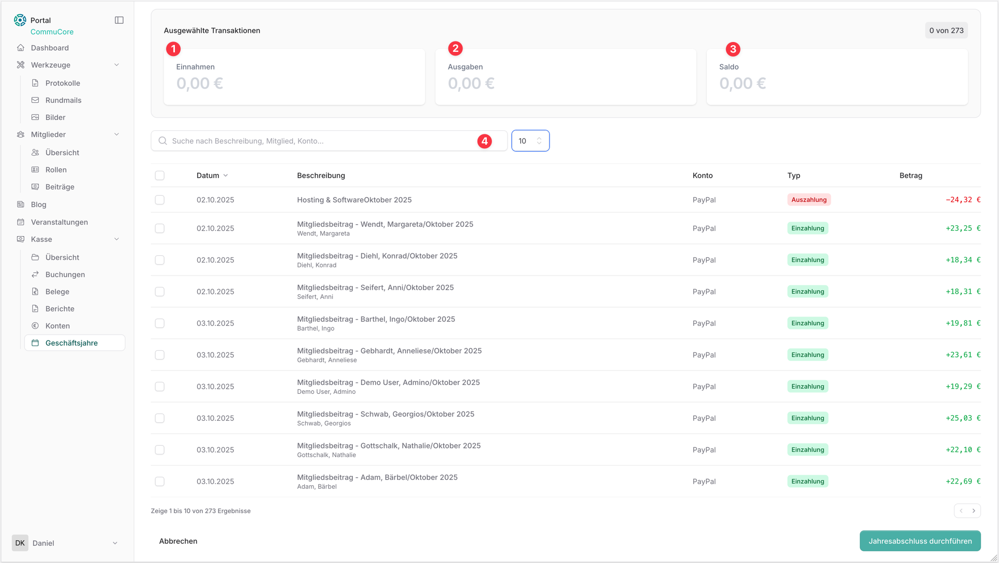

Es öffnet sich die Ansicht zur Transaktionsauswahl. Oben werden drei Kennzahlen der aktuell ausgewählten Transaktionen angezeigt:

- **① Einnahmen** – Summe aller ausgewählten Einzahlungen
- **② Ausgaben** – Summe aller ausgewählten Auszahlungen
- **③ Saldo** – Differenz aus Einnahmen und Ausgaben

Darunter befindet sich eine filterbare Tabelle mit allen verfügbaren Transaktionen:

- **④ Suchfeld** – Filtert nach Beschreibung, Mitglied oder Konto
- Spalten: Datum, Beschreibung, Konto, Typ (Einzahlung/Auszahlung), Betrag

---

### Schritt 3 – Transaktionen auswählen

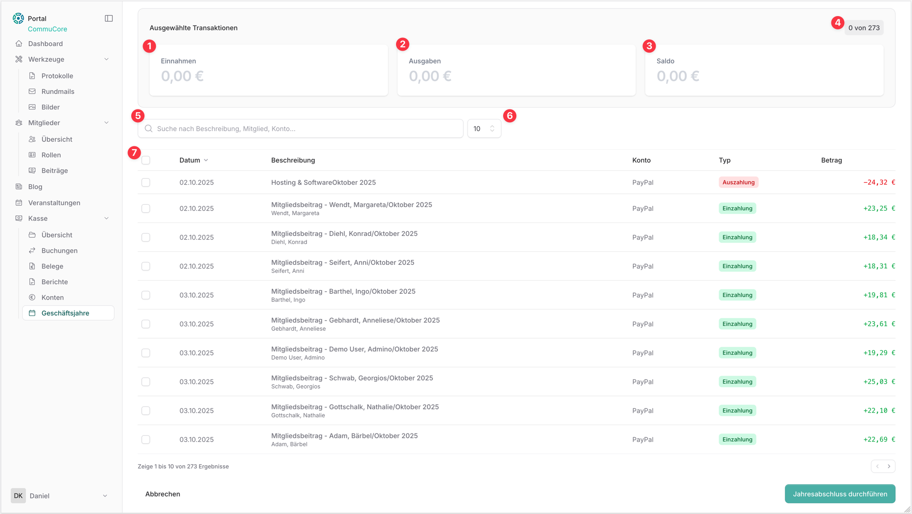

- **④ Anzahl** oben rechts zeigt die Gesamtzahl der gefundenen Transaktionen.
- **⑤ Suchfeld** – Filtert die Liste nach Beschreibung, Mitglied oder Konto.
- **⑥ Einträge pro Seite** – Steuert, wie viele Transaktionen pro Seite angezeigt werden.
- **⑦ Auswahlcheckbox** in der Kopfzeile – Wählt alle Transaktionen der aktuellen Seite aus.

Einzelne Transaktionen können per Klick auf ihre Checkbox aktiviert werden.

---

### Schritt 3b – Mehrere Transaktionen per Shift-Klick auswählen

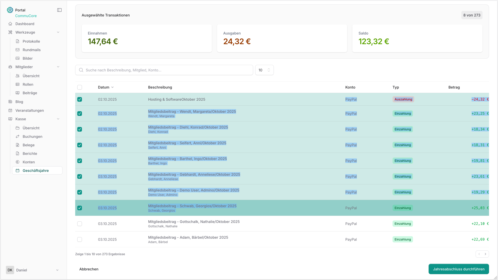

Um schnell mehrere aufeinanderfolgende Transaktionen auszuwählen, klicke zunächst auf die erste gewünschte Checkbox und anschließend mit gehaltener **Shift-Taste** auf die letzte. Alle Transaktionen dazwischen werden automatisch markiert (blau hinterlegt). Die Kennzahlen oben aktualisieren sich in Echtzeit.

---

### Schritt 3c – Alle Transaktionen auswählen

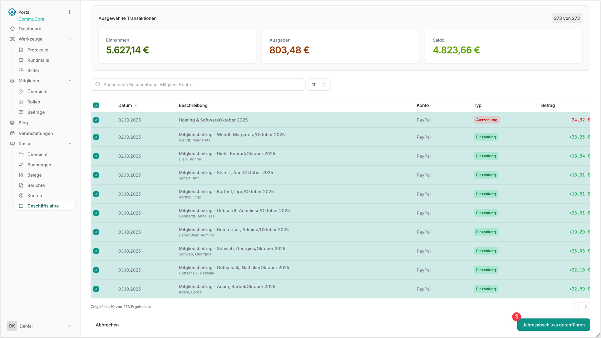

Durch Klick auf die **Checkbox in der Tabellenüberschrift** werden alle 273 Transaktionen auf einmal ausgewählt (273 von 273). Die Kennzahlen zeigen daraufhin die vollständigen Jahressummen. Klicke auf **Jahresabschluss durchführen** (**①**), um fortzufahren.

---

### Schritt 4 – Abschluss bestätigen

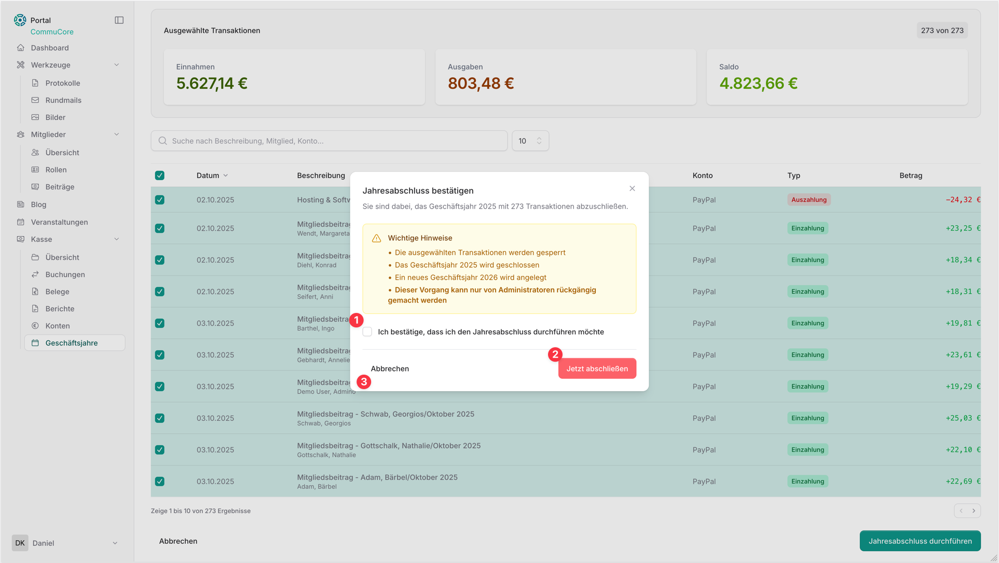

Es öffnet sich ein Bestätigungsdialog mit wichtigen Hinweisen:

> - Die ausgewählten Transaktionen werden gesperrt
> - Das Geschäftsjahr 2025 wird geschlossen
> - Ein neues Geschäftsjahr 2026 wird angelegt
> - **Dieser Vorgang kann nur von Administratoren rückgängig gemacht werden**

Gehe wie folgt vor:
1. Aktiviere die Checkbox **„Ich bestätige, dass ich den Jahresabschluss durchführen möchte"** (**①**).
2. Klicke auf **Jetzt abschließen** (**②**), um den Abschluss final durchzuführen.
3. Alternativ: Klicke auf **Abbrechen** (**③**), um den Vorgang zu beenden ohne zu speichern.

---

## Nach dem Abschluss

### Übersicht nach erfolgreichem Abschluss

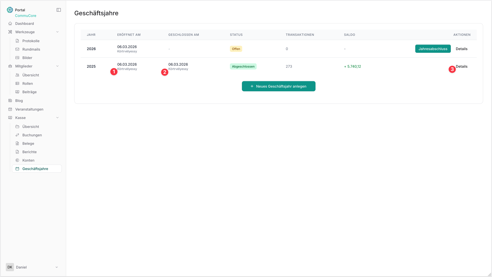

Nach dem Abschluss zeigt die Übersicht:

- Das Geschäftsjahr 2025 mit Status **Abgeschlossen** (**②**), dem Eröffnungsdatum (**①**) sowie einem positiven Saldo.
- Ein neu angelegtes Geschäftsjahr 2026 mit Status **Offen**.
- Über **Details** (**③**) lassen sich die Informationen des abgeschlossenen Jahres einsehen.

---

### Details eines abgeschlossenen Geschäftsjahres

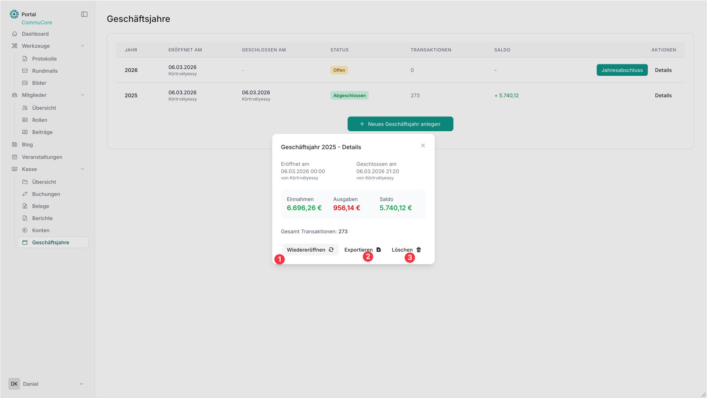

Der Detaildialog zeigt:

- Eröffnungs- und Schließdatum inkl. Benutzer
- Einnahmen, Ausgaben und Saldo
- Gesamtanzahl der Transaktionen

Folgende Aktionen stehen zur Verfügung:

| Aktion | Beschreibung |
|---|---|
| **① Wiedereröffnen** | Setzt das Geschäftsjahr zurück auf „Offen" (nur Administratoren) |
| **② Exportieren** | Exportiert alle Transaktionen des Jahres |
| **③ Löschen** | Löscht das Geschäftsjahr unwiderruflich (nur Administratoren) |